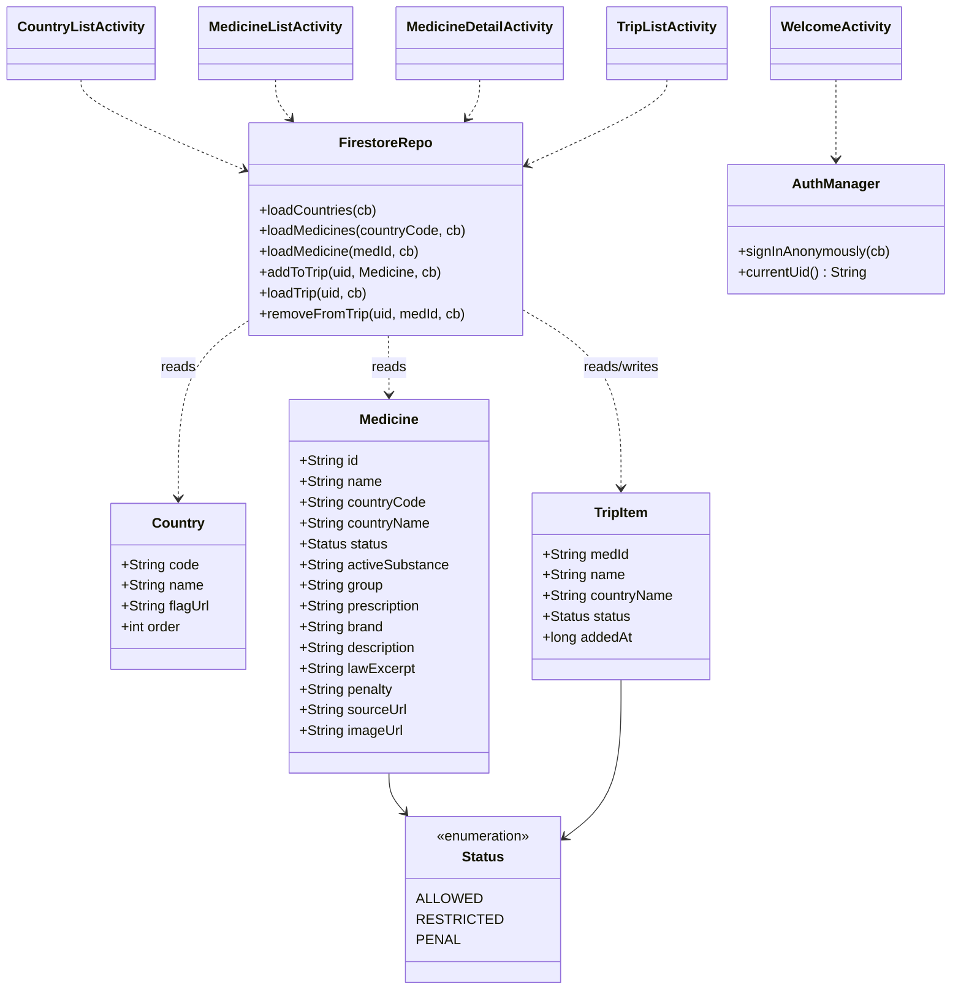

# MedTraveler — Parcial 2

Sigue siendo la misma app que arranqué en el parcial 1: un viajero quiere saber si los medicamentos que lleva en la valija son legales en el país al que va. En el parcial 1 tenía sólo la pantalla de detalle, hardcodeada con Tramadol en Argentina. Para esta entrega armé el camino completo que lleva hasta esa pantalla y le sumé una lista personal, login y datos reales traídos de la nube.

## El flujo

```
Bienvenida → Elegir país → Buscar medicamento → Detalle → Mi lista de viaje
```

Son cinco pantallas y se navega entre ellas pasando datos por `Intent` (el código de país y el id del medicamento van como extras).

### 1. Bienvenida (`WelcomeActivity`)

Es la pantalla de entrada. Tiene la imagen, el nombre y un botón "Entrar". Cuando lo tocás, hace un login anónimo con Firebase Auth (no quería obligar a registrarse con mail para algo así) y recién ahí te deja pasar. Ese usuario anónimo es el que después usa para guardar tu lista.

### 2. Elegir país (`CountryListActivity`)

Trae la lista de países desde Firestore y arma una fila por cada uno con la bandera y el nombre. Las banderas se bajan por URL con Glide, no están en el proyecto. Tocás un país y te lleva al listado de medicamentos de ese país, pasándole el código por extra. Arriba hay un botón "Mi lista" para saltar directo a tu lista de viaje.

### 3. Buscar medicamento (`MedicineListActivity`)

Muestra los medicamentos del país que elegiste, cada uno con su miniatura, la sustancia activa y un badge de color con el estado (verde permitido, naranja restringido, rojo penal). Arriba hay un buscador: a medida que escribís, la lista se filtra en vivo por nombre o por sustancia activa. Tocás uno y se abre el detalle.

### 4. Detalle (`MedicineDetailActivity`)

Es la pantalla que venía del parcial 1, pero ahora en vez de estar hardcodeada carga el medicamento desde Firestore según el id que le llega por extra. Mantiene todo lo de antes: el badge de estado que al tocarlo muestra una explicación, los "datos clave" que se arman desde Java, el extracto de la ley con estilo de cita que se expande al tocarlo, la penalidad y el botón que abre la fuente oficial en el navegador. Le agregué un botón "Agregar a mi lista de viaje" que guarda ese medicamento en Firestore, colgado de tu usuario.

### 5. Mi lista de viaje (`TripListActivity`)

Acá está el comportamiento dinámico. Lee lo que fuiste guardando y lo va metiendo en un `ScrollView`: cada medicamento aparece como una fila con un punto del color de su estado, el nombre y el país. Cada fila tiene un botón para quitarla, que borra el registro en Firestore y saca la fila al toque. Si no tenés nada guardado, muestra un mensaje de lista vacía. Como está atado al usuario, la lista sigue ahí la próxima vez que abrís la app.

## Los datos

El catálogo (países y medicamentos) vive en Firestore, en dos colecciones:

- `countries/{código}` → nombre, URL de la bandera, orden.
- `medicines/{id}` → nombre, país, estado, sustancia activa, grupo, receta, marca, descripción, extracto de ley, penalidad, fuente e imagen.
- `users/{uid}/tripList/{id}` → lo que cada usuario guarda en su lista.

Cargué cuatro países conocidos por ser estrictos con los medicamentos (Argentina, Japón, Emiratos Árabes Unidos y Singapur) con casos reales: Tramadol penado en Argentina y Emiratos, la pseudoefedrina prohibida en Japón bajo la ley de estimulantes, el CBD con tolerancia cero en Singapur, y varios más. Cada uno con su contexto legal y su imagen.

## Cómo correr

1. Hace falta un proyecto de Firebase con Authentication (modo anónimo activado) y Firestore.
2. Bajar el `google-services.json` del proyecto y ponerlo en `app/`.
3. Cargar el catálogo en Firestore (las colecciones `countries` y `medicines`).
4. Abrir el proyecto en Android Studio, esperar el Gradle sync y correrlo en un emulador con API 24+.

## Stack

Java, min SDK 24. Firebase Auth (anónimo) + Cloud Firestore para los datos y la lista. Glide para bajar las imágenes por URL. ConstraintLayout y LinearLayout para las pantallas.

## Estructura de clases


