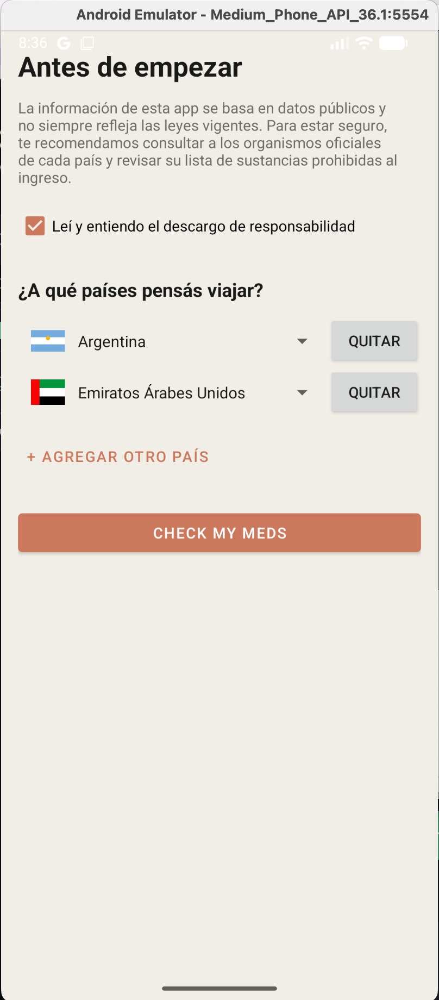
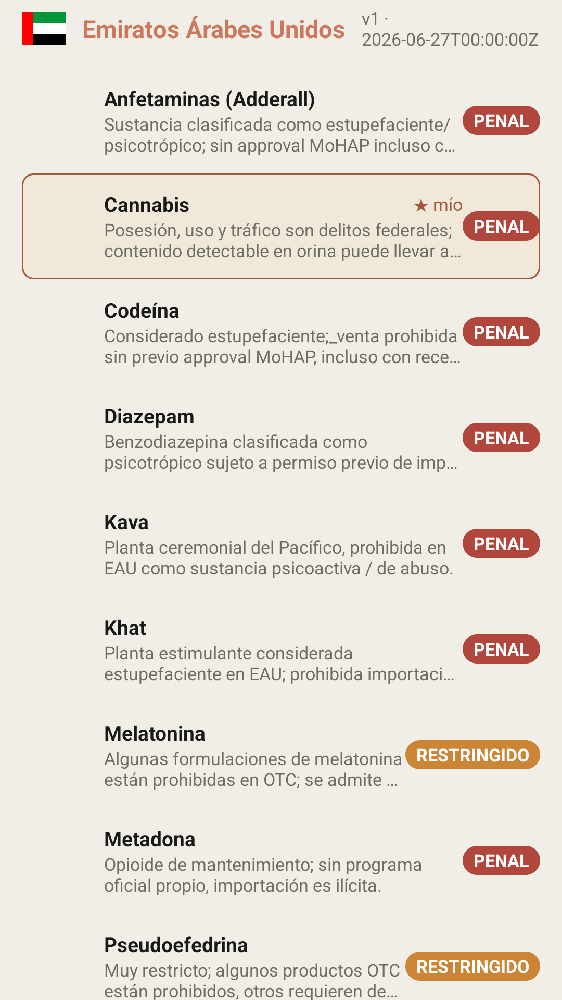
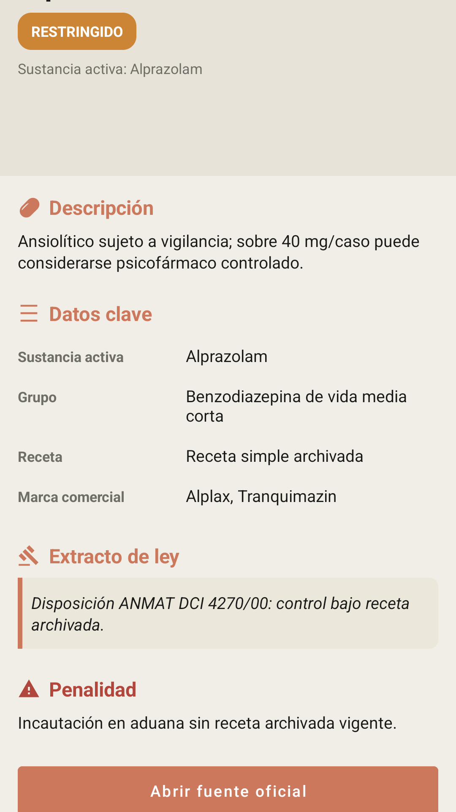
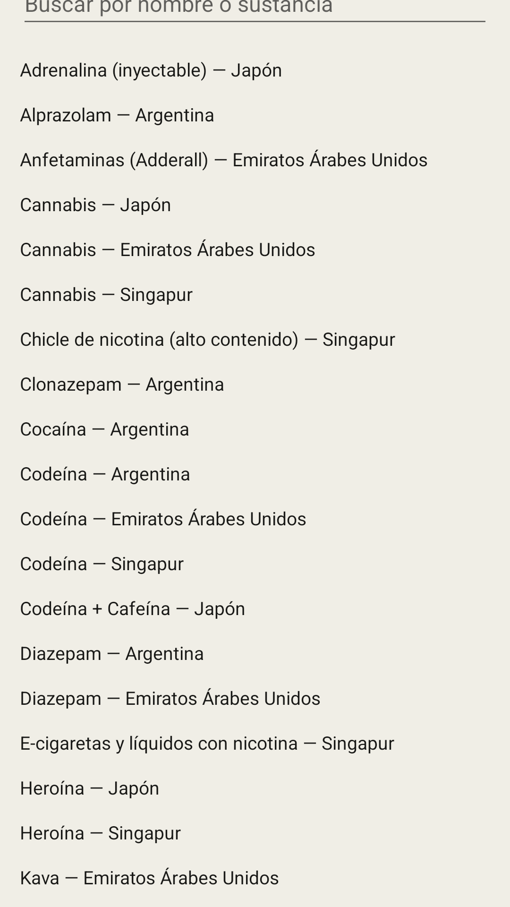
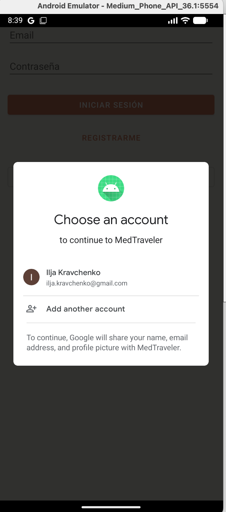
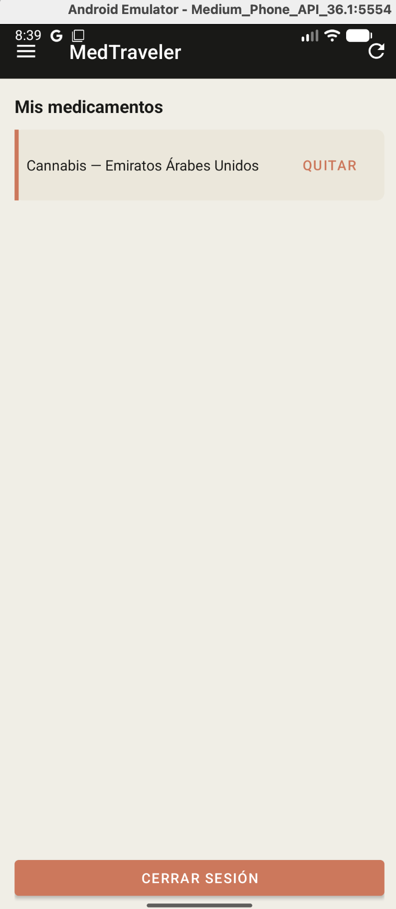
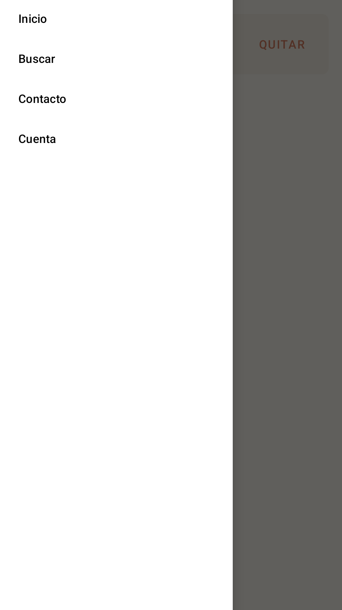

# MedTraveler

App de referencia para viajeros que quieren chequear si los medicamentos que
llevan consigo están prohibidos o restringidos en el país al que viajan. El
usuario acepta un descargo (EULA), elige hasta 3 países destino, ve por cada
país una lista de sustancias problemáticas con su contexto legal y,
opcionalmente, se registra / inicia sesión para guardar sus propios
medicamentos y verlos resaltados con "★ mío".

> Información referencial basada en datos públicos; no constituye
> asesoramiento legal ni médico. Verificá con los organismos oficiales de cada
> país.

## Flujo

```
Welcome (EULA + elegir país) → Checklist por país → Detalle de medicamento
                                                         │
                                                         └→ "Mis medicamentos"
Drawer: Inicio · Buscar · Contacto · Cuenta          ▲
                          └→ Login / Registro (email o Google) / Profile
   Contacto abre mail (mailto:); si no hay cliente de correo, Toast con la dirección.
```

## Pantallas

Por cada pantalla: funcionalidades y flujo de uso. Capturas en `docs/screenshots/`.

### 1. WelcomeActivity



**Funcionalidades:** EULA + checkbox; Spinner con bandera + nombre del país
(`CountrySpinnerAdapter`); "+ Agregar otro país" hasta 3, sin duplicados
(exclye lo ya elegido); botón `CHECK my meds` habilitado sólo si el EULA está
aceptado y hay ≥1 país.

**Flujo:** el usuario marca el EULA, agrega países destino (1–3) y toca
`CHECK my meds`, que envía `country_codes[]` por extra a `MedicineListActivity`.

### 2. MedicineListActivity



**Funcionalidades:** `ScrollView` con secciones por país (bandera + nombre +
`vN · fecha`); cada tarjeta: nombre + badge de estado coloreado (Restringido /
Penal) + imagen URL (Glide) + descripción; tap → detalle con `med_id` por
extra. En primer arranque siembra Room desde `assets/meds_seed.json`; luego
`CatalogUpdater` refresca por país vía REST. Medicamentos guardados por el
usuario logueado se resaltan "★ mío".

**Flujo:** se ven las secciones de los países elegidos; al tocar ⟳ en toolbar
se refresca el catálogo (barra de progreso superior + toast + notificación). Tap
en una tarjeta → detalle.

### 3. MedicineDetailActivity



**Funcionalidades:** cabecera (nombre, país, sustancia activa, imagen Glide);
badge de estado (tap = Toast explicativo); descripción; **Datos clave**
(sustancia, grupo, receta, marca) inflados en runtime; **Extracto de ley**
expandible al tocar (3 líneas ↔ completo); pena (código penal); botón "Abrir
fuente oficial" (`ACTION_VIEW` + `<queries>` mailto para Android 11+; Toast si
no hay navegador); botón "Tomo este medicamento" (guarda en Firestore
`users/{uid}/myMeds/{medId}` si hay sesión, sino deriva a `AuthActivity`).

**Flujo:** el usuario revisa la información y el extracto (lo expande tocándolo)
y, si lo lleva de viaje, toca "Tomo este medicamento" (pide sesión si no la hay).

### 4. SearchActivity



**Funcionalidades:** `EditText` con `TextWatcher` que filtra en vivo por nombre
o sustancia activa usando `util/SearchFilter` sobre todo el caché. Cada
resultado `nombre — país`; tap → detalle. Estado vacío "Sin resultados".

**Flujo:** drawer → **Buscar**; se escribe y se ve la lista filtrada en tiempo real.

### 5. AuthActivity



**Funcionalidades:** registro / login con email + contraseña con validación
(email no vacío, contraseña ≥ 6) y botones deshabilitados durante el request;
botón "Continuar con Google" (`GoogleSignInOptions` con `requestIdToken`,
`ActivityResultContracts.StartActivityForResult`, `GoogleAuthProvider`).
`try/catch` para que inputs vacíos no crashean la app. Toast "Sesión iniciada"
y `finish()` al éxito.

**Flujo:** se entra vía drawer → **Cuenta**; se registra o se loguea y se vuelve.

### 6. ProfileActivity ("Mis medicamentos")



**Funcionalidades:** lee `users/{uid}/myMeds` desde Firestore; cada fila
`nombre — país` con botón **Quitar** (borra y refresca); mensaje si está vacía;
botón **Cerrar sesión**.

**Flujo:** drawer → **Cuenta** (sólo si logueado); quita medicamentos o cierra sesión.

### 7. Drawer (común)



`BaseActivity` monta el toolbar, el drawer y la barra de progreso superior
indeterminada. Header muestra "Base actualizada: <fecha>" (la más reciente entre
los países en caché, refrescado en `onResume`). Ítems: Inicio, Buscar, Contacto
(sólo si hay sesión), Cuenta (→ Auth o Profile según haya sesión). Toolbar trae
el botón ⟳ de **Update DB**.

## Datos

- **Catálogo** (público, read-only) → **Realtime Database** descargado **por
  país** vía REST (`GET .../meds/{code}.json` con OkHttp), cacheado en **Room**.
  Seed inicial en `assets/meds_seed.json`. Estados `RESTRICTED` / `PENAL`.
  Países y banderas embebidos en `model/CountryCatalog` (fuente única de nombres,
  las imágenes/banderas no se descargan).
- **Lista personal** → **Firebase Auth** (email/contraseña o Google) +
  **Firestore** (`users/{uid}/myMeds/{medId}` = `{ name, countryCode, addedAt }`).
  Reglas `firestore.rules` permiten sólo al uid dueño leer/escribir su subárbol.

`version` y `updatedAt` por país vienen del nodo RTDB y se persisten
localmente (`Room` + `CatalogMeta` en SharedPreferences).

## Stack

Java 11 · min SDK 24 · target SDK 36 · AndroidX AppCompat + Material Components
· ConstraintLayout / LinearLayout · Firebase Auth + Firestore + Realtime
Database (REST con OkHttp, no el SDK) · Room (caché) · Glide (imágenes URL).

## Cómo correr

1. Proyecto Firebase con Auth (Email/Password + Google), Realtime Database +
   Firestore (reglas en `parcial2-planning/medcatalog/`).
2. `google-services.json` → `app/`.
3. Cargar el catálogo en Realtime Database
   (`parcial2-planning/medcatalog/meds_rtdb_import.json`).

```bash
./gradlew :app:installDebug
adb shell am start -n com.davinci.medtraveler/.ui.WelcomeActivity
./gradlew :app:testDebugUnitTest    # unit tests
./gradlew :app:bundleRelease        # .aab firmado (ver app/build.gradle)
```

## Build de release (Google Play)

Play exige **AAB**, no APK. Generar un keystore release aparte (`*.jks`, nunca
committeado — ver `.gitignore`), crear `keystore.properties` en la raíz del
repo (también gitignored), registrar SHA-1/SHA-256 del keystore en la Console de
Firebase y bajar de nuevo `google-services.json` (sin esto, **Google Sign-in no
funciona en production**), luego `./gradlew :app:bundleRelease` produce
`app/build/outputs/bundle/release/app-release.aab`. `minifyEnabled=false` para
minimizar riesgo en la primera publicación; `proguard-rules.pro` ya trae
keep-rules para model/Room/Glide/Firebase por si se habilita más adelante.

## Estructura

```
app/src/main/java/com/davinci/medtraveler/
├── data/   Catalog · CatalogJson · CatalogMeta · CatalogRepo ·
│           CatalogUpdater(OkHttp) · AuthManager · UserMedsRepo(Firestore)
│           └── local/  AppDatabase · MedDao(@Transaction) · MedEntity
├── model/  CountryCatalog · Medicine · Status(RESTRICTED/PENAL)
├── ui/     BaseActivity(drawer+toolbar+progress) · Welcome · MedicineList ·
│           MedicineDetail · Search · Auth · Profile · CatalogNotifier ·
│           CountrySpinnerAdapter
└── util/   SearchFilter
```